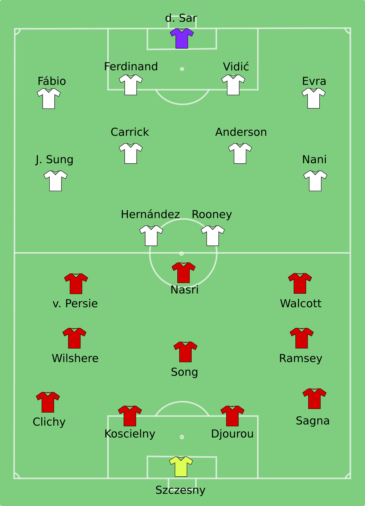

# teamproject_team
# project subject
자신만의 축구팀 만들기!! 

# Introduction to team project
자신만의 축구 팀을 만들고 싶지 않으세요? 
저희의 프로그램이 만들어 드리겠습니다. 

# Describe the features to include in the project
1. 선수 전체 조회
2. 전체 리스트에 선수 추가
3. 특정 선수 정보 수정
4. 선수 삭제
5. 리스트 파일에 저장
6. 특정 선수 name조회
7. 본인 팀에 선수 추가/삭제
8. 본인 팀 포메이션 추가
9. 본인 팀 포메이션에 선수 포지션 설정하기
10. 본인 포메이션 보기
11. 본인팀 리스트 보기
12. 본인팀 포메이션 변경

# 개발환경 및 언어
ubuntu- 20.04.6 LTS
C Language

# 팀 소개 
21800068 김동환
21800204 김형진 
=======
# 팀프로젝트 주제
자신만의 축구팀 만들기 !! 

# 팀프로젝트에 대한 소개
자신만의 축구팀을 만들고 싶지 않으세요? 
저희 프로그램이 도와드리겠습니다. 
 

# project 에 포함시킬 기능 설명

선수 조회 
선수 추가
특정 선수 team, name, league 조회
자기 팀 추가
자기 팀 포메이션 추가
자기팀 조회
자기팀 삭제
자기팀 선수 삭제
자기팀 포메이션 변경

# 개발환경 및 언어 
C언어 
ubuntu 20.04.6 LTS

# 팀소개 및 팀원이 맡은 역활
21800068 김동환 -> 자기 팀 추가 ,자기 팀 포메이션 추가 , 자기팀 조회

21800204 김형진 -> 자기팀 삭제 ,자기팀 선수 삭제 ,자기팀 포메이션 변경

  
